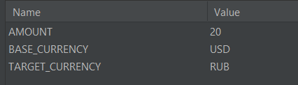

# Описание задачи
## Задача 1: Создать приложение перевода курса валют "Рубли в доллары" и наоборот
### Файлы
- **currency.py**: Python скрипт, с запросом к внешнему api для получения текущего курса валют
- **secrets.py**: Данный файл содержит api ключ, который по-хорошему нужно скрыть, но удобства ради зальем его на гит
### Запуск программы
1. Необходимо в переменных окружения указать параметры `BASE_CURRENCY` `TARGET_CURRENCY` `AMOUNT`

-Пример:


### Результаты выполнения скрипта
- Результат перевода будет выведен на экран
- Пример:


## Задача 2: Вывод таблицы ФИО всех преподавателей в зачетке

### Файлы и программы
- **db_init.sql**: SQL-скрипт с инициализацией таблиц и заполнением данными.
- **main.py**: Программа на Python, которая выполняет запрос к базе данных и записывает результат в файл.
- **output/query_result.txt**: Файл, в который записывается вывод запроса к базе данных.

### Структура таблиц
1. Таблица `students` содержит информацию о студентах.
2. Таблица `subjects` содержит информацию о предметах.
3. Таблица `exams` содержит информацию о проведенных экзаменах.
4. Таблица `grades` содержит информацию о зачетах (оценках) студентов.

### Запуск программы
1. Запустите скрипт `create_compose.py` для создания docker-compose файла с вашими параметрами
2. Необходимо указать параметры `--database_name=YOUR_DB_NAME` `--db_user=USER` `--db_pass=PASSWORD`

### SQL-запрос в main.py
```sql
SELECT DISTINCT e.professor_name, s.subject_name
FROM exams e
JOIN subjects s ON e.subject_id = s.subject_id;
```

### Результаты запроса 
Результат запроса будет записан в файл output/query_result.txt в виде таблицы, содержащей ФИО преподавателей и названия предметов.